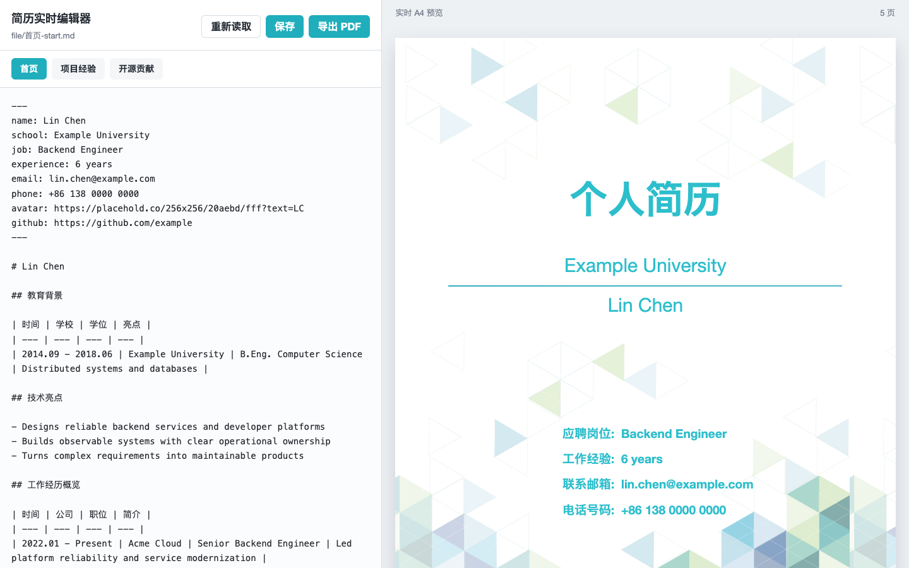

# Resume Editor

English | [简体中文](docs/zh-CN/README-cn.md)

<p align="center">
  <a href="LICENSE"></a>
  
  
</p>

**Edit a multi-section Markdown resume on your machine, preview print-sized A4 pages as you type, and export the same layout through your browser.**

<p align="center">
  
  <br>
  <em>One workspace for Markdown editing, page-aware preview, local saves, and PDF export.</em>
</p>

## What it does

- **Keeps local files as the source of truth.** The bundled Node.js server reads the configured Markdown documents and writes changes back to disk when you save.
- **Previews the printable result immediately.** The editor renders A4-sized pages, displays the current page count, and repaginates as the content changes.
- **Separates long resumes into focused sections.** Switch between the profile, project experience, and open-source contribution tabs without working in one oversized document.
- **Supports practical resume formatting.** Headings, lists, links, tables, inline HTML, and explicit page breaks are rendered with `markdown-it`.
- **Exports through the browser.** The PDF action opens the native print dialog using the same A4 preview shown on screen.

## Quick start

### Requirements

- Node.js 18 or newer
- npm
- A modern desktop browser

### Run locally

```bash
git clone https://github.com/hsiong/project-resume-editor.git
cd project-resume-editor/code
npm install
npm run build
node server.mjs 5173 dist
```

Open [http://localhost:5173](http://localhost:5173), then stop the server with `Ctrl+C` when you are finished.

To use another port, replace `5173` in the last command:

```bash
node server.mjs 5174 dist
```

## Everyday workflow

1. Choose a section from the tab bar.
2. Edit its Markdown in the left pane; the A4 preview updates as you type.
3. Select **Save** to write all configured sections back to local storage.
4. Select **Export PDF**, then choose **Save as PDF** in the browser print dialog.

**Reload** reads the files from disk again and replaces the current in-browser editor state. Save any work you want to keep before reloading.

## Formatting and pagination

The profile section uses a structured Markdown format for the cover and overview pages. The other sections accept regular Markdown, including tables and lists.

Insert the following block between two pieces of content to force the next one onto a new A4 page:

```html
<div class="page-break"></div>
```

The page-break marker affects the rendered preview and print output; it is hidden from the final document.

## How local persistence works

| Step | Component | Result |
| --- | --- | --- |
| Load | `code/server.mjs` | Reads the configured documents under `code/data/` through `GET /api/docs` |
| Edit | `code/src/main.js` | Keeps the active Markdown in browser memory and rerenders the preview |
| Save | Local HTTP API | Sends each section to `POST /api/docs/:id` and overwrites its mapped file |
| Export | Browser print engine | Prints only the A4 preview pages |

Resume content is handled by the local server and stored in local Markdown files. The default visual template references some remotely hosted decorative images, and a resume may also contain remote avatar or link URLs. Replace those resources with local assets if you need a fully offline workflow.

## Project structure

```text
.
├── code/
│   ├── data/          # Local Markdown data sources
│   ├── src/           # Editor, renderer, pagination, and styles
│   ├── server.mjs     # Static server and local document API
│   └── package.json   # Vite and markdown-it dependencies
├── docs/              # Localized README and product images
├── LICENSE
└── README.md
```

## Development

Install dependencies once, then use the production build as the smallest project check:

```bash
cd code
npm install
npm run build
```

The application is intentionally small: a Vite-powered vanilla JavaScript frontend, `markdown-it` for rendering, and a Node.js HTTP server for local persistence.

## Current scope

- The workspace is desktop-first and currently requires at least `1080px` of horizontal space.
- PDF output depends on the browser's print engine and selected print settings.
- Automatic pagination moves top-level blocks and list items between pages; use an explicit page break when a precise boundary matters.
- Saving updates all three configured sections, not only the active tab.

## Contributing

Issues and pull requests are welcome. Keep changes focused, verify `npm run build`, and describe any visible print or pagination differences in the pull request.

## License

Resume Editor is distributed under the [GNU General Public License v3.0](LICENSE).
