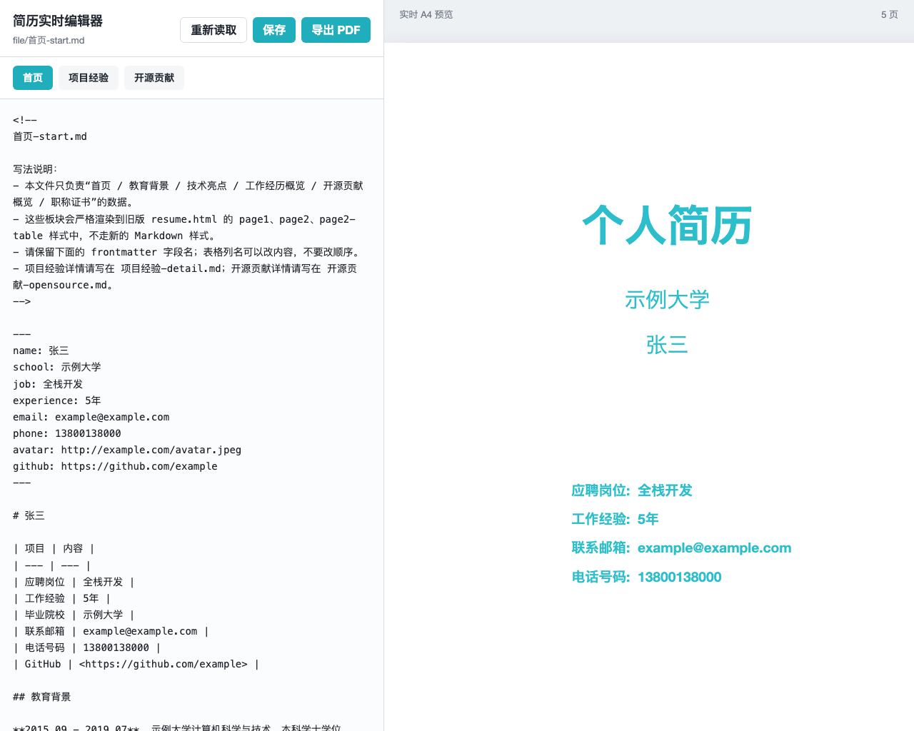

# 简历实时编辑器 (Resume Editor)

一款支持本地实时预览、直接写盘和高保真 A4 排版导出的 Markdown 简历编辑器，专为开发者打造。



## 快速开始

启动本地服务（首次启动会自动安装依赖）：

```bash
cd code
./start.sh
```

在浏览器中打开 [http://localhost:5173/](http://localhost:5173/) 即可开始编辑。

编辑完成后，停止服务：

```bash
# 需在 code 目录下执行
./stop.sh
```

> **自定义端口**：如果端口被占用，可以通过环境变量指定，例如 `PORT=5174 ./start.sh`，并在停止时执行 `./stop.sh 5174`。

## 核心特性

- **所见即所得**：左侧按「首页 / 项目经验 / 开源贡献」分板块编辑，右侧实时渲染 A4 排版效果。
- **安全写盘**：数据不留存在前端，点击「保存」会通过本地 Node.js 服务将三份 Markdown 实时写回磁盘。
- **一键 PDF 导出**：右侧共用同一份 A4 预览 DOM，点击「导出 PDF」直接唤起浏览器打印窗口，目标打印机选择「另存为 PDF (Save as PDF)」即可。
- **灵活的分页控制**：支持标准 Markdown 语法及部分 HTML（如表格、链接、列表）。若需要手动分页，只需在 Markdown 中插入 `<div class="page-break"></div>`。

## 文件结构

初始内容不再硬编码在前端，而是读取 `code/data/` 目录下的本地文件作为数据源：

- `首页-start.md`：只作为数据源，渲染时自动填入预设的经典排版样式。
- `项目经验-detail.md`：详细的项目经历，采用原生的 Markdown A4 排版解析。
- `开源贡献-opensource.md`：参与的开源项目及贡献。
